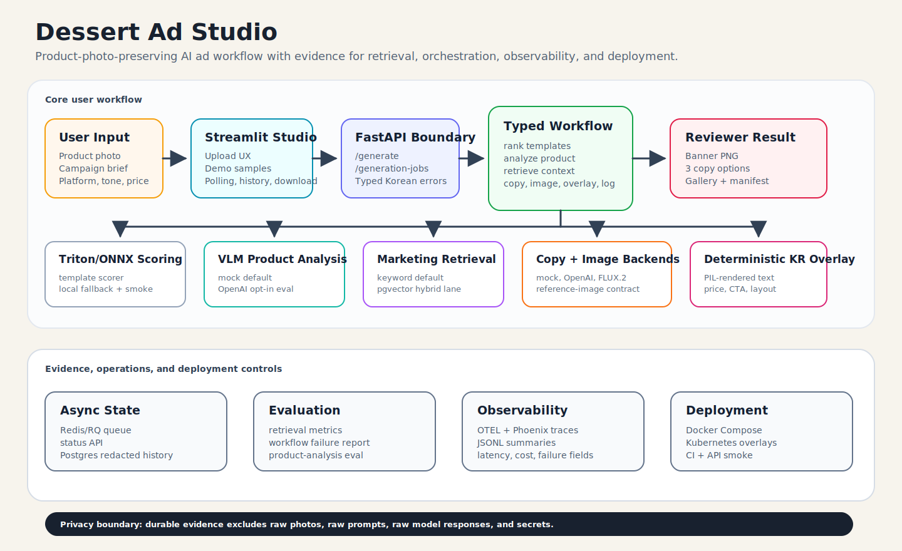

# Dessert Ad Studio

Small-business ad banner studio for cafe, bakery, and local-store owners.

The app turns a product photo and a short marketing request into Korean ad copy,
a generated or composed visual, and a downloadable banner with deterministic
Korean text overlay.

Final portfolio target: a production-grade Agentic RAG workflow for
small-business ad generation. The current multimodal ad workflow remains the
business domain; the next architecture layer is a typed graph control plane for
retrieval, tool orchestration, guardrails, approval, streaming, eval, trace, and
deployment evidence.

## Problem

Small business owners often need SNS banners, menu images, and promotion copy, but design tools and prompt engineering add friction. A raw image-generation model also tends to distort Korean text, so the service separates visual generation from Korean text rendering.

## What The Demo Does

1. Choose a demo sample or enter a product manually in Streamlit.
2. Generate three Korean ad-copy options through FastAPI.
3. Generate one representative ad visual through the selected image backend.
4. Optionally add a concise revision request such as premium tone, discount emphasis, or shorter copy.
5. Render headline, price, and CTA with a PIL overlay.
6. Download the finished PNG banner.

## Current Verification Scope

Verified:

- Deterministic Korean overlay and demo banner generation.
- Curated marketing retrieval eval, offline chunking comparison, and a measured
  pgvector storage/query lane.
- Offline LangGraph control-plane first gate with typed state, conditional
  HITL routing, local tool-suite node, keyword retrieval, citations, checkpoint
  evidence, local mock worker execution, redacted cited ad package summary,
  retry/reflection test coverage, and redacted summary artifact.
- Local Agentic RAG tool-suite first gate with document retrieval, local
  web-search snapshot, allowlisted SQLite SQL query, in-process internal API
  policy preview, and FastMCP package import/tool-call smoke.
- FastAPI async SSE run-streaming and local SQLite replay first gate for the
  Agentic RAG control plane, with node progress events through the local mock
  worker and redacted event/replay payloads.
- Local WebSocket bidirectional approval first gate for approval-routed runs,
  with in-stream reviewer decision, redacted `approval_completed` event, and
  in-process post-approval worker resume.
- Local HITL approval API first gate for approval-routed runs, with redacted
  reviewer/comment hashes, in-process post-approval worker resume, and no
  persistent audit-retention claim.
- Local redacted SQLite cross-process resume first gate for mock approval runs,
  with pending in-memory context cleared before approval and no raw inputs
  committed.
- Local Streamlit reviewer approval UI first gate for approval-routed runs,
  with replay-backed pending state, redacted reviewer/comment hashes, and no
  paid API calls.
- Agentic RAG retention boundary policy for replay, approval, resume, and trace
  payloads, keeping durable raw request storage, live-provider cross-process
  resume, and external trace payload retention behind explicit user decision.
- Local OpenInference trace first gate for Agentic RAG graph nodes, with
  redacted span attributes and API stream tracer wiring.
- Local Agentic RAG run-metrics first gate for latency, mock token/cost,
  tool-call success/failure, failed-run analysis, and redacted graceful
  fallback summary.
- Reviewer-facing offline Agentic RAG eval report that consolidates golden
  eval, retrieval, chunking, pgvector, promptfoo, and guardrail evidence.
- Demo video storyboard with an 8-shot, 180-second recording plan that references
  committed reviewer assets and keeps provider-quality image editing unproven.
- Offline text-contamination proxy calibration for the provider-quality gate,
  keeping dark non-text texture below threshold while preserving a dense
  rendered-text negative case.
- Local Agentic RAG eval gates: deterministic Ragas-compatible proxy metrics,
  real promptfoo package smoke, and GitHub Actions CI steps for both paths.
- AI agent team operating model with main-writer ownership, read-only scouts,
  task-lock template, lane fast gates, and paid-provider tripwires.
- Docker Compose smoke, Redis/RQ job path, redacted Postgres history, and
  local AgentOps trace evidence.
- Kubernetes manifests that render through Kustomize with probes, ingress, HPA,
  Triton, Streamlit, and AgentOps overlays, plus a live `kind` smoke that
  applied the base stack, synced Triton models, reached pod readiness, and
  passed full API `/generate`.

Known gaps:

- Paid OpenAI image-edit provider gates have failed; the deterministic
  preservation path and offline visual proxy pass, but provider-quality image
  editing is not proven. The latest paid canary passed ROI and script cost
  checks but failed latency and the pre-calibration text proxy.
- Agentic RAG is still at first-gate maturity. Local SQLite checkpointing,
  SSE/WebSocket streaming, graph tracing, local tool-suite orchestration, and a
  local eval/guardrail plus promptfoo package gate are proven, and reviewer
  approval UI plus in-process post-approval worker resume, mock-only redacted
  SQLite cross-process resume, and bidirectional WebSocket approval have local
  first gates, and the retention boundary policy is recorded. Live web search,
  production DB access/audit policy, production MCP auth provider/remote client
  smoke, live-provider cross-process resume, approved production storage,
  deployment-specific external trace retention, and Ragas live evaluator
  execution are still pending.
- Current eval sets are demo-scale and need a larger real/product-like scenario
  matrix before broader quality claims.

## Core Features

- Upload-centered Streamlit Studio UI
- Three reusable demo scenarios
- Korean copy candidates
- Mock Product Analysis by default, with an opt-in OpenAI vision analyzer
- Deterministic Korean banner overlay
- Concise revision-request field for regenerated variants
- Downloadable finished banner
- Backend adapter slots for mock, OpenAI, and FLUX.2
- JSONL generation logging

## Architecture



The core service boundary is FastAPI. Streamlit is the reviewer-facing upload
studio, while retrieval, product analysis, copy/image generation, deterministic
Korean overlay, async state, tracing, evals, and deployment evidence are kept as
separate verifiable layers.

## Quick Start

```bash
python3 -m venv .venv
source .venv/bin/activate
pip install -e ".[dev]"
```

Run the API:

```bash
uvicorn api.main:app --reload --port 8000
```

## Optional A2A Interoperability Spike

The API exposes a narrow A2A-compatible surface for portfolio interoperability evidence.
It does not replace the normal REST API or the Streamlit UI.

Discovery:

```text
GET /.well-known/agent-card.json
```

Task execution:

```text
POST /message:send
Content-Type: application/a2a+json
```

The supported skill is `generate_ad_banner`. The first message part must contain a JSON
`data` object using the same fields as `POST /generate`.

Run a local smoke test after starting the API:

```bash
python scripts/a2a_smoke.py --base-url http://127.0.0.1:8000
```

Use A2A when another agent needs to discover and call Dessert Ad Studio as a remote
agent capability. Use the normal REST API for app/frontend calls. FastMCP now has
a local server at `mcp_servers/dessert_ad_studio_server.py` with package
import/tool-call smoke coverage and a loopback-only `streamable-http`
transport/auth boundary; production auth provider selection and remote client
smoke remain pending.

Run Streamlit:

```bash
streamlit run app/streamlit_app.py
```

Open:

```text
http://localhost:8501
```

The default mock backends work without API keys.

## Demo Scenarios

The Streamlit `데모 샘플` selector includes:

| Scenario | Product | Platform | Goal |
| --- | --- | --- | --- |
| Dessert cafe | 딸기 크림 크루아상 | Instagram feed | New menu launch |
| Bakery | 말차 푸딩 | Instagram story | Seasonal event |
| Flower shop | 봄 플라워 박스 | Smartstore thumbnail | Reservation discount |

Generated assets are written to:

```text
outputs/
outputs/streamlit-banners/
logs/generations.jsonl
```

## Configuration

Copy `.env.example` to `.env` and edit local values. Do not commit `.env`.

| Variable | Values | Default |
| --- | --- | --- |
| `COPY_BACKEND` | `mock`, `openai` | `mock` |
| `PRODUCT_ANALYSIS_BACKEND` | `mock`, `openai` | `mock` |
| `IMAGE_BACKEND` | `mock`, `openai`, `flux2` | `mock` |
| `COPY_MODEL_ID` | any chat model id | `gpt-5.4-mini` |
| `PRODUCT_ANALYSIS_MODEL_ID` | any vision-capable Responses model id | `gpt-5.4-mini` |
| `IMAGE_MODEL_ID` | any GPT image model id | `gpt-image-1-mini` |
| `IMAGE_QUALITY` | `low`, `medium`, `high` | `low` |
| `OPENAI_MAX_ESTIMATED_COST_USD` | optional per-run smoke budget | unset |
| `OPENAI_COPY_INPUT_USD_PER_1M_TOKENS` | optional text input price override | unset |
| `OPENAI_COPY_OUTPUT_USD_PER_1M_TOKENS` | optional text output price override | unset |
| `OPENAI_IMAGE_USD_PER_1M_TOKENS` | optional image token price override | unset |

Real OpenAI backends need `OPENAI_API_KEY` in `.env`.
`PRODUCT_ANALYSIS_BACKEND=openai` sends the product request and optional
reference image to OpenAI through the Responses API with structured output and
`store=False`.

Uploading a reference image in Streamlit switches the OpenAI image backend from text-to-image to edit mode. The `flux2` backend is text-to-image only for now: uploading a reference image with it returns a 400 instead of silently ignoring the photo.

## Tests

```bash
pytest -q
ruff check .
```

## Portfolio Evidence

The senior-review path is collected in
[`docs/evidence/README.md`](docs/evidence/README.md): retrieval evals,
pgvector comparison, async job/history hardening, OTEL/Phoenix traces,
workflow failure reports, Kubernetes render evidence, and OpenAI product
analysis evals. The reviewer-visible result gallery is
[`docs/evidence/demo-gallery.md`](docs/evidence/demo-gallery.md), with
committed PNG banners under
[`docs/evidence/assets/demo-gallery/`](docs/evidence/assets/demo-gallery/).
The Streamlit reviewer flow screenshots are in
[`docs/evidence/streamlit-reviewer-flow.md`](docs/evidence/streamlit-reviewer-flow.md).
Real-sample deterministic preservation evidence is in
[`docs/evidence/real-sample-preservation.md`](docs/evidence/real-sample-preservation.md).
The paid OpenAI image-edit preservation failures and the strengthened
provider-quality gate definition are documented in
[`docs/evidence/openai-image-edit-preservation.md`](docs/evidence/openai-image-edit-preservation.md).
The README architecture image is
[`docs/evidence/assets/architecture.svg`](docs/evidence/assets/architecture.svg).

Rebuild the deterministic gallery:

```bash
python scripts/build_demo_gallery.py --date 2026-06-16
```

Manual smoke:

```bash
python scripts/openai_smoke.py                      # copy + text-to-image
python scripts/openai_smoke.py my_product_photo.jpg # copy + reference edit
python scripts/flux2_smoke.py                       # needs [image] deps
```

## AgentOps Evidence

Run deterministic local evals over the bundled demo samples:

```bash
python scripts/eval_demo_samples.py --output docs/evidence/workflow-eval-summary.json
```

Run a local console trace smoke:

```bash
WORKFLOW_TRACING=otel WORKFLOW_TRACE_EXPORT=console python scripts/otel_trace_smoke.py
```

Run Phoenix locally through the optional compose override:

```bash
python scripts/export_template_scorer_onnx.py
docker compose -f docker-compose.yml -f docker-compose.agentops.yml up --build
```

In another shell, trigger a workflow span through the API smoke. Keep the
default generate step enabled for Phoenix evidence:

```bash
python scripts/api_smoke.py --base-url http://127.0.0.1:8080
```

Open:

```text
Phoenix: http://localhost:6006
```

The override sends API workflow spans to Phoenix through OTLP HTTP at
`http://phoenix:6006/v1/traces`; look for `dessert-ad-studio-api` spans after
the smoke request. Phoenix remains optional; normal local evals, REST calls, and
Streamlit usage do not require it.

## Docker Compose Demo

Generate the ONNX model before starting Triton:

```bash
python scripts/export_template_scorer_onnx.py
docker compose up --build
```

To use `openai` backends in the compose demo, put `OPENAI_API_KEY` and backend overrides in `.env` beside `docker-compose.yml`.

Open:

```text
Streamlit: http://localhost:8501
FastAPI:   http://localhost:8080
Triton:    http://localhost:8000
```

## Kubernetes Deployability Evidence

Kubernetes manifests live under `deploy/k8s`:

```bash
kubectl kustomize deploy/k8s/base
kubectl kustomize deploy/k8s/overlays/gpu
kubectl kustomize deploy/k8s/overlays/agentops
```

The base stack includes FastAPI, Streamlit, Triton, PVCs, NGINX Ingress, health
probes, resource requests/limits, and API HPA. Live `kind` evidence now covers
base apply, Triton model PVC sync, `api`/`app`/`triton` readiness, API
port-forward, and full `/generate` smoke. The AgentOps overlay routes API
workflow traces through OpenTelemetry Collector to Phoenix.

Evidence:

```text
docs/evidence/k8s-deployment.md
```

## Advanced GPU / FLUX.2 Validation

On an NVIDIA GPU machine, start only the API service with the GPU overlay:

```bash
docker compose -f docker-compose.yml -f docker-compose.gpu.yml up --build -d --no-deps api
```

The overlay installs `[image]` extras, switches `IMAGE_BACKEND=flux2`, and sets `REQUIRE_TRITON=0` so template scoring falls back to the local scorer. The first request downloads model weights into the `hf-cache` volume.

Full VM procedure:

```text
docs/runbooks/gcp-flux2-validation.md
```

## Roadmap

1. Extend the Agentic RAG control plane from local graph/tool-suite/SSE/WebSocket/SQLite/replay/trace/run-metrics/reviewer-approval/resume plus mock-only redacted cross-process resume, bidirectional approval, and retention-boundary first gates to live-provider cross-process resume, approved production storage, and deployment-specific external trace retention.
2. Add Ragas live evaluator execution only after paid eval approval and trace/result payload review.
3. Rerun a one-sample paid `gpt-image-2` + `quality=medium` canary after the offline text-contamination proxy calibration, then decide whether latency remediation or a full gate is warranted.
4. Add human visual review or provider-quality visual statistics for generated assets.
5. Select MCP production auth provider and run a remote client transport/auth smoke before claiming production MCP operation.

FastMCP is still a thin wrapper, not the core product path. The current server
exposes local `search_marketing_guides`, `query_template_policy`, and
`preview_generation_policy` tools with a loopback-only `streamable-http`
boundary; production MCP auth provider and remote client smoke remain pending.
