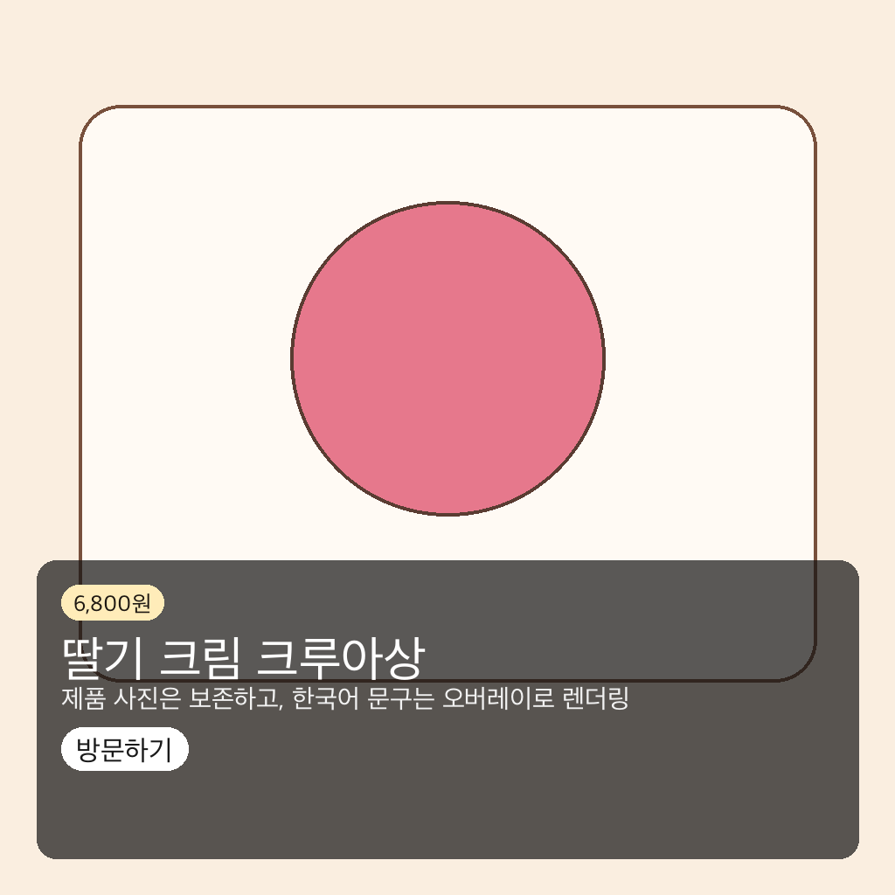
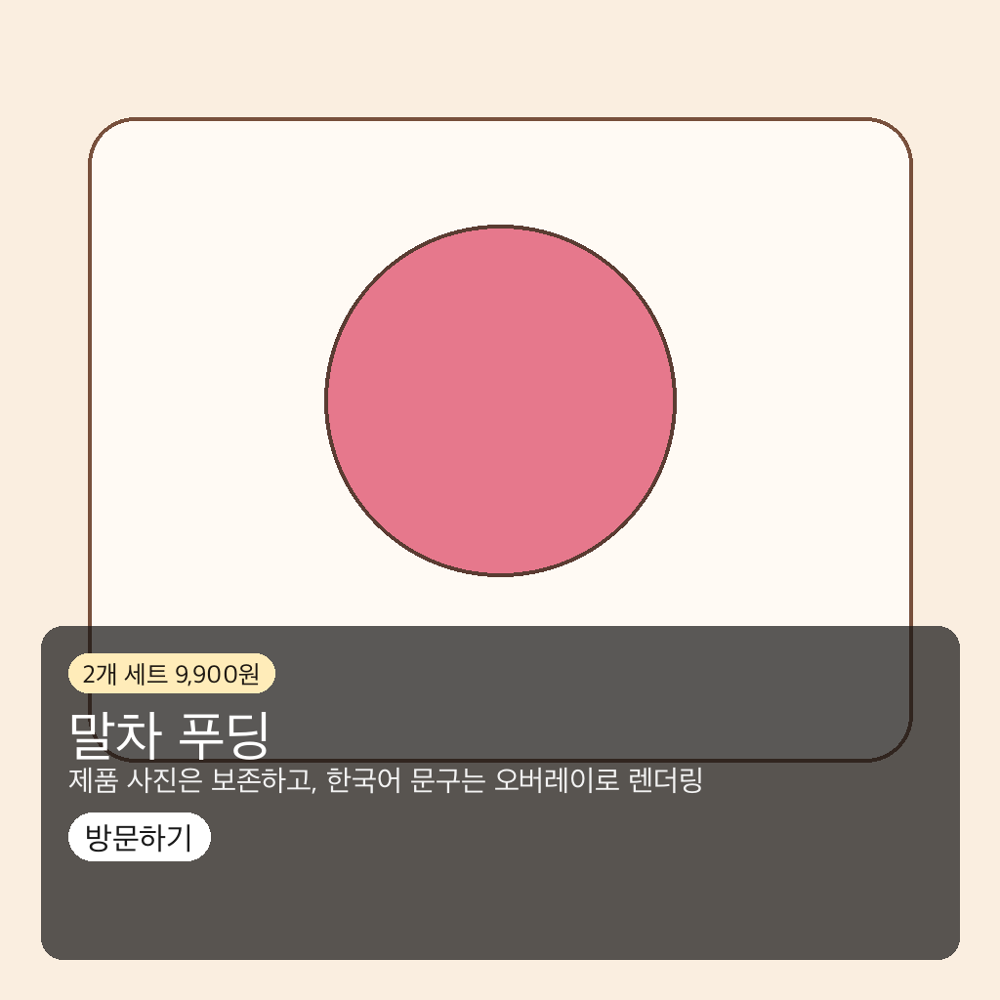
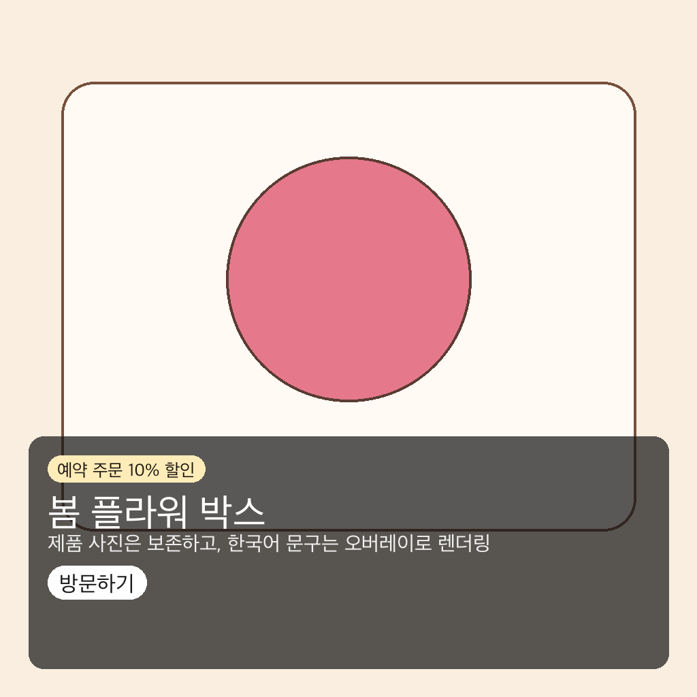

# Demo Gallery Evidence

Date: 2026-06-16

This gallery is generated from the deterministic mock workflow. It is
portfolio evidence for result UX, Korean overlay rendering, and the
representative small-business scenarios used by the local demo.

## Summary

- Sample count: `3`
- Banner count: `3`
- Result: `passed`

## Gallery

| Scenario | Platform | Banner |
|---|---|---|
| 디저트 카페 - 딸기 크림 크루아상 / `딸기 크림 크루아상` | 인스타그램 피드 |  |
| 베이커리 - 말차 푸딩 / `말차 푸딩` | 인스타그램 스토리 |  |
| 꽃집 - 플라워 박스 / `봄 플라워 박스` | 네이버 스마트스토어 썸네일 |  |

## Reproduce

```bash
.venv/bin/python scripts/build_demo_gallery.py
```

Generated banners are committed under
`docs/evidence/assets/demo-gallery/`. The raw generated images and
generation logs stay under `outputs/` and `logs/`, which are ignored.
