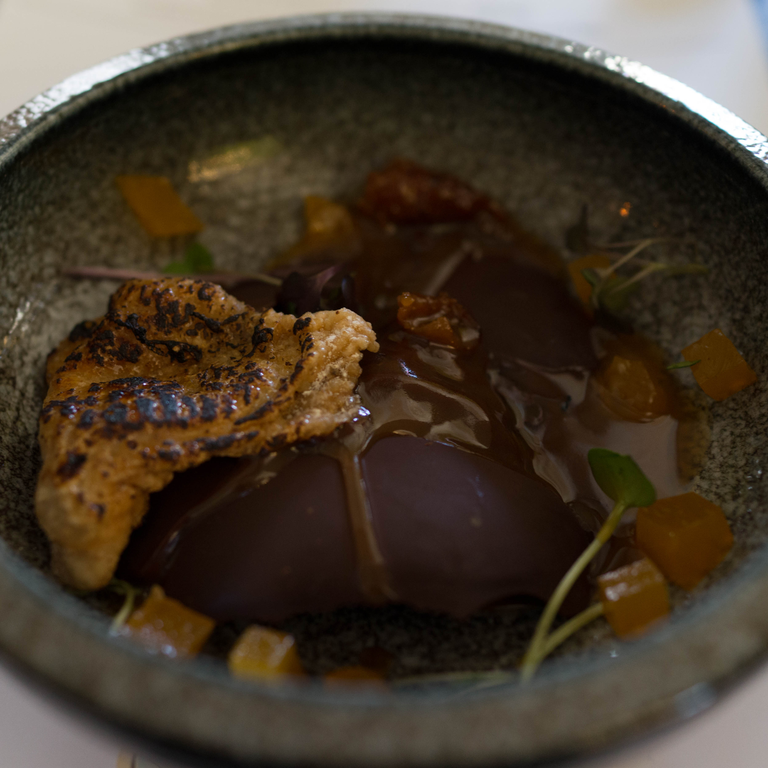
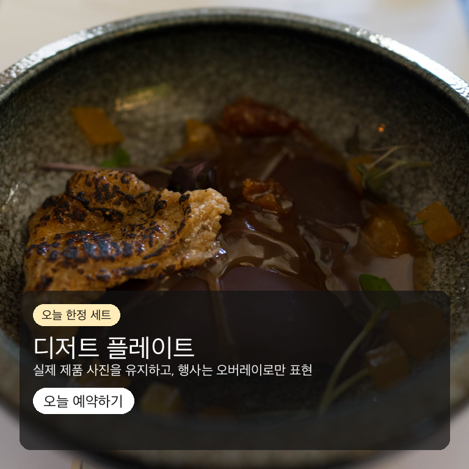
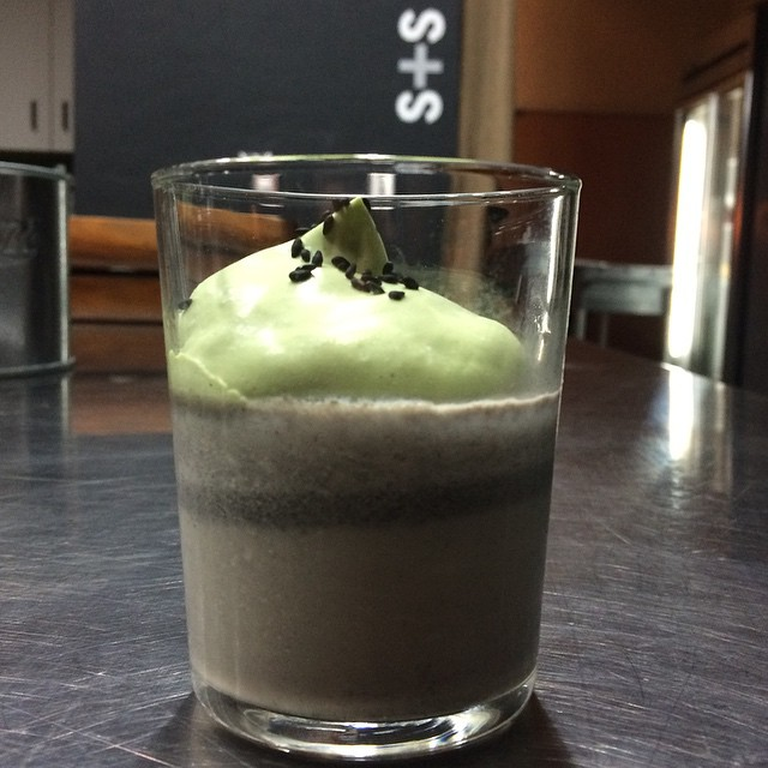
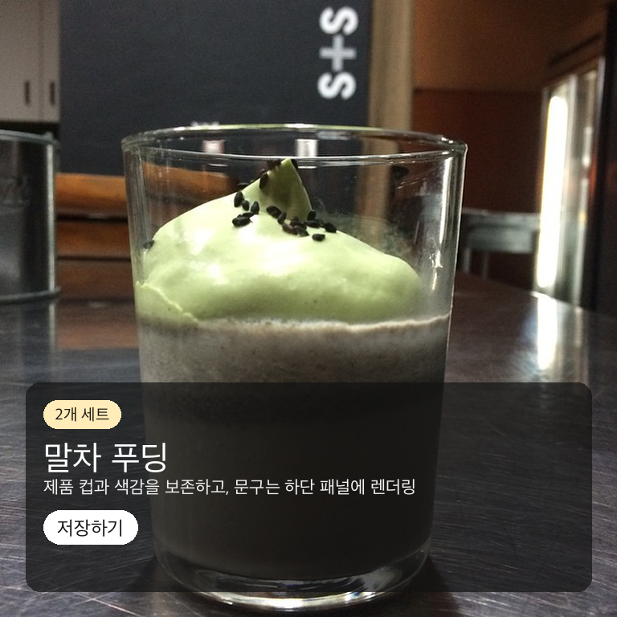
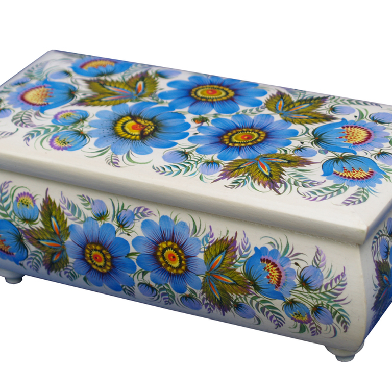
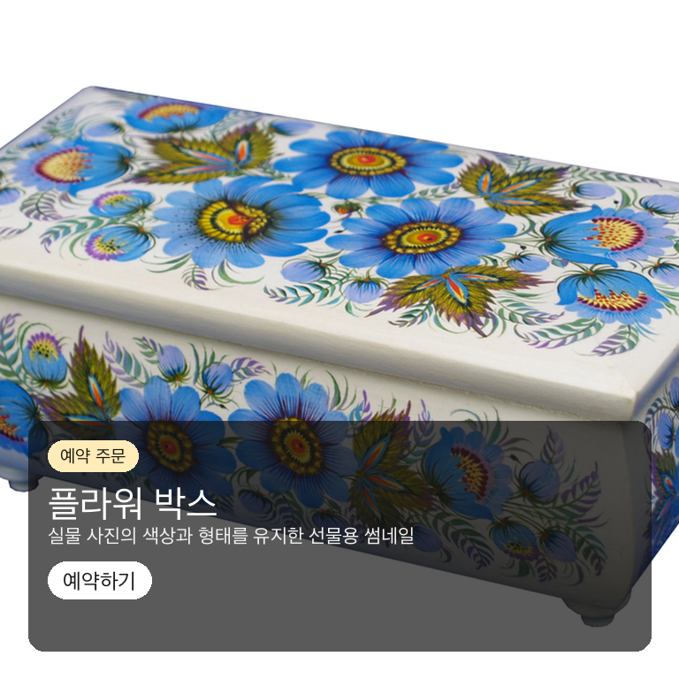

# Real-Sample Product Preservation Evidence

Date: 2026-06-16

This evidence uses public Wikimedia Commons images as real product-photo
stand-ins. The deterministic preservation path keeps the normalized
reference image as the banner base and renders Korean copy as an overlay.

## Summary

- Sample count: `3`
- Passed: `3`
- Pass rate: `1.00`
- Metric: top 55% pixel match between reference and banner must be `>= 0.99`.
- Minimum observed match ratio: `1.000000`

## Samples

| Sample | License | Reference | Banner | Match ratio |
|---|---|---|---|---|
| Dessert plate / `디저트 플레이트`<br>[source](https://commons.wikimedia.org/wiki/File:Dessert_(28307972126).jpg)<br>Attribution: Charles Haynes | [CC BY-SA 2.0](https://creativecommons.org/licenses/by-sa/2.0) |  |  | `1.000000` |
| Matcha pudding / `말차 푸딩`<br>[source](https://commons.wikimedia.org/wiki/File:Black_Sesame_pudding,_Matcha_Chantilly_Cream_(15229247433).jpg)<br>Attribution: Arnold Gatilao | [CC BY 2.0](https://creativecommons.org/licenses/by/2.0) |  |  | `1.000000` |
| Flower box / `플라워 박스`<br>[source](https://commons.wikimedia.org/wiki/File:Blue_flowers_box.jpg)<br>Attribution: Наталія Статива-Жарко | [CC BY-SA 4.0](https://creativecommons.org/licenses/by-sa/4.0) |  |  | `1.000000` |

## Reproduce

```bash
.venv/bin/python scripts/build_real_sample_preservation_evidence.py --date 2026-06-16
```

The command downloads public sample images from the source URLs listed
in the manifest, normalizes them to 1024x1024, generates overlay
banners, and writes the redaction-safe metric summary.

## Boundary

- These are public sample images, not customer uploads.
- Raw model prompts, live provider responses, secrets, and customer data
  are not stored.
- This proves the deterministic local composition path. It does not claim
  final OpenAI/FLUX image-edit preservation quality.
