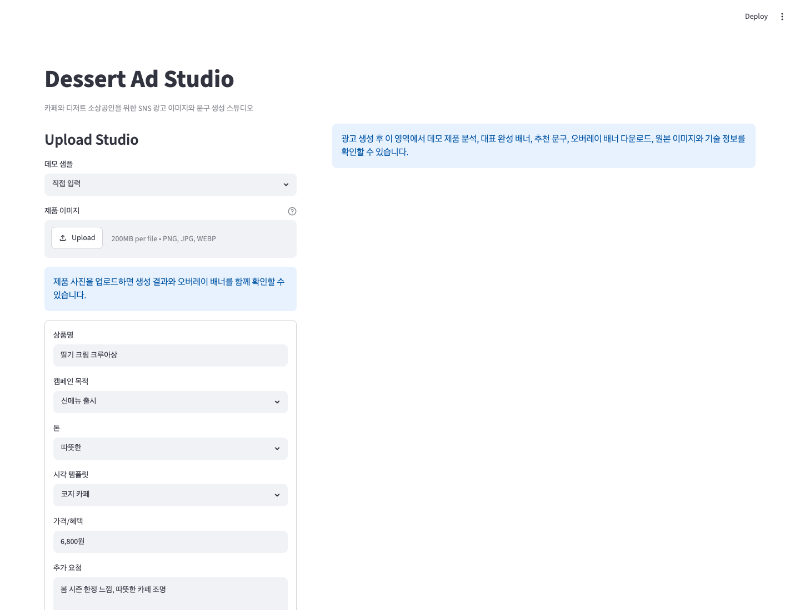
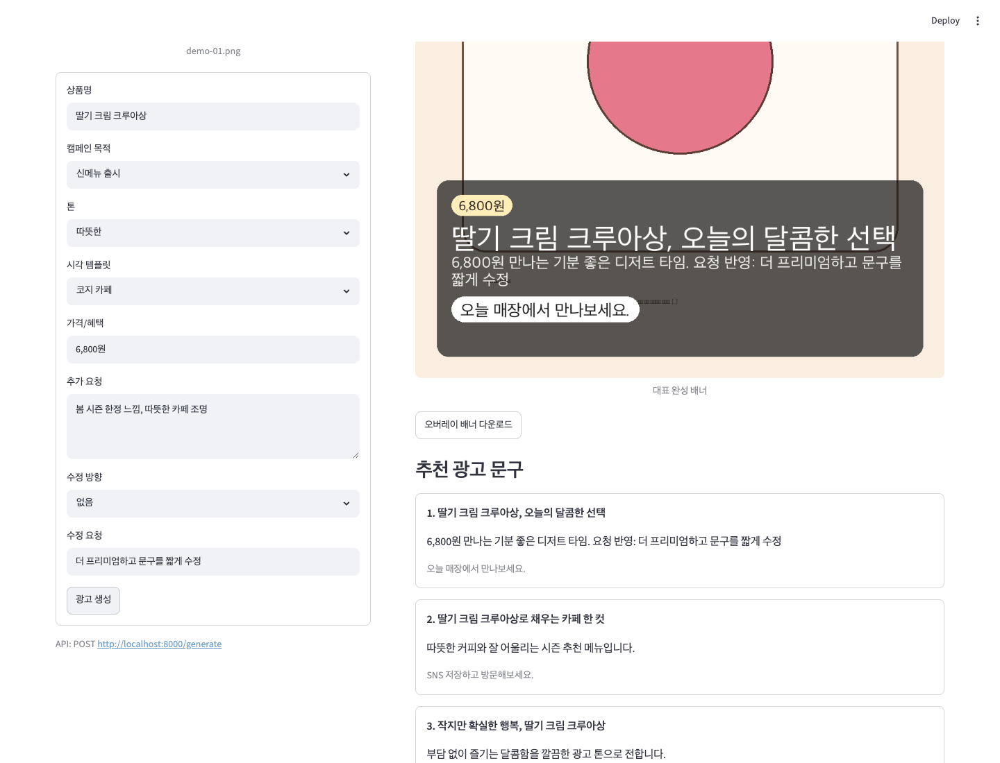

# Streamlit Reviewer Flow Evidence

Date: 2026-06-16

This evidence captures the local reviewer-facing Streamlit flow with mock,
inline, memory-backed services. It verifies that a reviewer can inspect inputs,
submit a product-photo generation request, see the revised banner result, and
download the overlaid PNG without external API keys.

## Screenshots

| State | Evidence |
|---|---|
| Input form with revision request field |  |
| Generated result with revised copy and download action |  |

## Reproduce

Run the local API:

```bash
COPY_BACKEND=mock \
IMAGE_BACKEND=mock \
PRODUCT_ANALYSIS_BACKEND=mock \
GENERATION_QUEUE_BACKEND=inline \
GENERATION_HISTORY_BACKEND=memory \
OUTPUT_DIR=outputs \
API_BASE_URL=http://localhost:8000 \
.venv/bin/uvicorn api.main:app --host 127.0.0.1 --port 8000
```

Run Streamlit:

```bash
API_BASE_URL=http://localhost:8000 \
STREAMLIT_BROWSER_GATHER_USAGE_STATS=false \
.venv/bin/streamlit run app/streamlit_app.py \
  --server.address 127.0.0.1 \
  --server.port 8502 \
  --server.headless true
```

Captured flow:

1. Open `http://127.0.0.1:8502`.
2. Fill `수정 요청` with `더 프리미엄하고 문구를 짧게 수정`.
3. Upload `docs/evidence/assets/demo-gallery/demo-01.png`.
4. Submit `광고 생성`.
5. Confirm `대표 완성 배너`, `오버레이 배너 다운로드`, and revised copy are visible.

## Privacy Boundary

The screenshots use deterministic mock data and a committed demo gallery image.
No raw customer image, secret, external API response, or live model prompt is
included.
