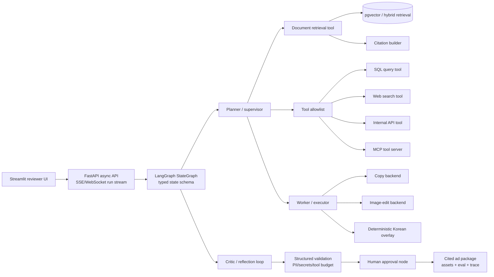
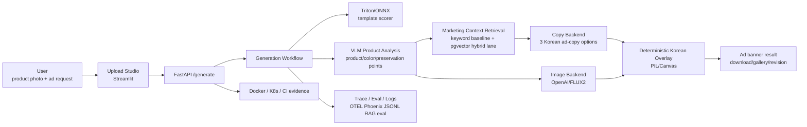

# Dessert Ad Studio Final Outcome Target

Updated: 2026-06-17

## Final Product Definition

Dessert Ad Studio v2 is a **Production-grade Agentic RAG System for
small-business ad generation**.

The product is not a generic RAG chatbot and not an image-generation demo. The
user uploads a product photo and a short marketing request. An Agentic RAG
control plane retrieves business evidence, plans tool calls, validates
guardrails, requests human approval when needed, orchestrates copy/image/overlay
workers, streams execution state, and returns cited ad assets with evaluation,
trace, cost, failure, and deployment evidence.

## Canonical Portfolio Goal

This repository should be presented as:

> A production-grade Agentic RAG workflow that retrieves business evidence,
> orchestrates tools with a typed graph, enforces guardrails, streams execution
> state, and produces cited ad assets with evaluation, tracing, cost controls,
> failure analysis, and deployability evidence.

The project should not be framed as "a dessert ad app" or "an image generation
demo." The dessert/cafe domain is the concrete business scenario. The hiring
signal is the ability to build, evaluate, observe, and deploy a multimodal AI
workflow as a reliable service.

## Final Deliverable Scope

The final artifact should prove the following integrated system:

The concrete domain remains Korean small-business advertising. The portfolio
claim is the production engineering around Agentic RAG: backend contracts,
stateful orchestration, retrieval quality, tool safety, eval, tracing, cost,
fallbacks, and deployment evidence.

## Capability Classification

| Category | Must be included in final portfolio | Strong bonus | Not required for this portfolio |
|---|---|---|---|
| Backend | Python 3.11+, FastAPI, Pydantic schemas, async endpoints, SSE or WebSocket streaming | Separate reviewer UI for human approval | Replacing FastAPI with another backend framework |
| Agent orchestration | LangGraph StateGraph, typed state schema, conditional edges, retry/reflection loop, supervisor-worker or planner-executor, SQLite/Postgres checkpointing, human-in-the-loop approval node | Multi-agent decomposition with independent worker traces | RLHF or custom agent training |
| RAG | Document ingestion, chunking comparison, embeddings, vector DB, hybrid search or reranker, citations, retrieval fallback | GraphRAG or knowledge graph evidence | Broad web-scale corpus |
| Tools | Web search, SQL query, internal API, document retrieval, tool allowlist | One MCP tool server | Large marketplace of tools |
| Evaluation | Golden dataset, Ragas metrics, promptfoo regression, CI eval gate | Ragas + promptfoo trend report across releases | Human preference training loop |
| Observability | Phoenix or LangSmith tracing, latency, token usage, cost, tool success/failure, failed-run analysis | Two tracing backends compared | Production APM contract with real customer traffic |
| Guardrails | Structured output validation, prompt-injection tests, max tool-call budget, PII/secrets leakage prevention, graceful fallback | Agent security/red-team report | Formal verification |
| Deployment | Docker, GitHub Actions, architecture diagram, eval report | Cloud deploy on AWS/GCP/Azure, Kubernetes, Terraform, demo video | Robotics, theorem proving, custom SLM training |

## Korean Hiring Validation

Validated on 2026-06-15 against roughly 45 non-duplicate Korean AI Agent, RAG,
LLMOps, backend AI, and inference-serving job postings across Wanted, Remember,
Saramin/Jumpit, JobKorea, and company career pages. This sample is enough to
fix the portfolio direction, but not enough for exact market-share statistics.

| Repeated Korean hiring signal | Portfolio implication |
|---|---|
| RAG, retrieval, vector DB, hybrid search, reranking | Build keyword retrieval first, then add measured hybrid/vector retrieval. Do not claim RAG quality without eval evidence. |
| FastAPI, API contracts, backend service operation | Keep FastAPI as the core service boundary and add job/status, history, failure handling, and smoke evidence. |
| Docker, Kubernetes, CI/CD, health checks, monitoring | Treat deployability and operational evidence as first-class deliverables, not extras. |
| LangGraph/LangChain/LlamaIndex, tool/function calling, agent workflow | Show an explicit typed workflow for product analysis, retrieval, copy, image, overlay, and evaluation. |
| LLMOps/AgentOps, quality evaluation, trace, latency/cost/failure monitoring | Add reproducible evals, OTEL/Phoenix traces, JSONL summaries, and regression checks. |
| vLLM, Triton, ONNX, TensorRT, SGLang | Keep Triton/ONNX as concrete serving proof. Add vLLM/TensorRT only when a measured serving benchmark supports the story. |
| MCP/A2A | Treat as a later thin integration layer and hiring bonus, not the main product path. |

Confirmed positioning:

> For the Korean market, the strongest senior portfolio angle is not model
> novelty. It is measured retrieval + AI backend + workflow orchestration +
> evaluation + observability + deployability evidence.

## Current Verification Scope

Verified:

- Deterministic preservation/composition path for public samples.
- Korean text rendering through deterministic overlay instead of image-model
  text rendering.
- Curated retrieval baseline plus a measured pgvector storage/query lane.
- Redis/RQ and Postgres job/history path in Docker Compose.
- Local/demo AgentOps trace evidence, Kubernetes Kustomize render evidence, and
  live `kind` base-stack smoke with Triton model sync plus full `/generate`.
- First trace/log privacy allowlist gate for workflow traces, generation logs,
  image-failure usage logs, and OTEL smoke output.
- Kubernetes async overlay and live `kind` smoke for Redis/RQ worker plus
  Postgres generation history.
- First async reliability matrix for burst submit, failure state, queue enqueue
  failure, duplicate polling, worker startup wait, and K8s async smoke.
- 30-scenario product-like deterministic workflow eval with failure-case summary
  fields.
- Final target architecture decision: Agentic RAG control plane over the
  existing multimodal workflow, recorded in
  [`docs/adr/0011-agentic-rag-control-plane-final-target.md`](../adr/0011-agentic-rag-control-plane-final-target.md).
- First LangGraph control-plane gate: typed graph state, deterministic
  planner/retriever/citation/guardrail/HITL/finalize nodes, conditional
  approval routing, local mock worker execution through the existing generation
  workflow, retry/reflection test coverage, in-memory checkpoint proof,
  3 citations, 7 approval checkpoints, 8 worker checkpoints, and redacted
  summary evidence in
  [`docs/evidence/agentic-rag-graph.md`](../evidence/agentic-rag-graph.md).
- First FastAPI async SSE/WebSocket streaming and replay gate:
  `POST /agentic-rag/runs/stream` returns `text/event-stream`, WebSocket
  `/agentic-rag/runs/ws` sends JSON event envelopes, both surfaces emit 8
  redacted run/node/completion events or messages, stream local graph progress
  through `execute_worker`, emit a durable `agr-*` run id, and support redacted
  local SQLite replay through `GET /agentic-rag/runs/{run_id}/replay`. Evidence
  is recorded in
  [`docs/evidence/agentic-rag-streaming.md`](../evidence/agentic-rag-streaming.md).
- First durable SQLite checkpoint gate: local `langgraph-checkpoint-sqlite`
  persists 8 checkpoints, a reopened connection lists the same 8 checkpoints,
  the worker route completes, and raw inputs are absent from the SQLite file.
  Evidence is recorded in
  [`docs/evidence/agentic-rag-sqlite-checkpoint.md`](../evidence/agentic-rag-sqlite-checkpoint.md).
- AI agent team operating model: ADR 0015, main-writer ownership, read-only
  scouts, task-lock template, lane fast-gate CLI, and paid-provider tripwire
  lane are recorded in
  [`docs/evidence/agent-team-operating-model.md`](../evidence/agent-team-operating-model.md).
- First Agentic RAG graph trace gate: 6 local OpenInference-compatible
  LangGraph node spans, API stream tracer wiring, and redacted span attributes
  are recorded in
  [`docs/evidence/agentic-rag-trace.md`](../evidence/agentic-rag-trace.md).
- First Agentic RAG eval/guardrail gate: 13 local golden cases produce
  Ragas/promptfoo-compatible JSON fields, deterministic faithfulness, answer
  relevancy, context precision, and context recall proxy scores are `1.0`,
  prompt-injection routes to HITL before worker execution, tool allowlist/budget
  checks pass, raw inputs remain absent from artifacts, and the same script is
  wired as a GitHub Actions CI step. Evidence is recorded in
  [`docs/evidence/agentic-rag-eval-guardrail.md`](../evidence/agentic-rag-eval-guardrail.md).
  ADR `0016-agentic-rag-eval-runtime` selects offline promptfoo package
  execution as the next default-CI candidate and keeps Ragas live metrics behind
  paid/API-key approval.

Not yet proven:

- Full LangGraph production orchestration. The first offline graph, SSE, local
  SQLite checkpoint, local replay, and local graph trace gates are complete, but
  reviewer approval UI, Postgres or production storage policy, and production
  trace retention policy remain pending.
- Full production streaming. SSE, WebSocket, and local SQLite replay first gates are
  complete; bidirectional approval, production replay retention
  policy, and production stream trace integration remain pending.
- Actual Ragas and promptfoo package execution in CI. ADR 0016 now selects the
  runtime shape and adds the promptfoo config/provider scaffold, but default CI
  still runs the compatibility gate. The first local `npx promptfoo@0.121.17`
  package attempt exceeded 150 seconds before completion, so promptfoo
  runtime/cache behavior must be fixed or bounded before CI promotion. Ragas
  live metrics remain paid/API-key gated.
- Agent tool suite covering web search, SQL query, internal API, document
  retrieval, and one MCP tool server.
- Production-grade citation assembly across retrieved documents and generated
  ad outputs.
- Cloud deployment and demo video.
- Provider-quality image editing. The first paid OpenAI image-edit gate failed;
  the strengthened `gpt-image-2` + `quality=medium` gate also failed. ROI
  preservation checks passed, but latency, text-contamination, and cost guard
  checks failed.
- Production async operation. Kubernetes now has a local/test async overlay
  smoke, first reliability matrix, single worker outage/restore evidence, and
  explicit retry/timeout/cancel non-support evidence, but not multi-worker
  failure handling or production storage policy.
- Production trace privacy. The first allowlist gate is complete, but external
  production trace rollout still needs a deployment-specific attribute review.
- Broad real-world quality statistics. Current evals now include 30
  product-like deterministic scenarios and an offline visual proxy over 6
  committed banners, but not human-rated real customer outcomes or
  provider-quality visual statistics.

## Target Architecture

## Required Features

| Area | Final target |
|---|---|
| Input | Product photo upload plus product name, price/benefit, campaign purpose, tone, platform, and target audience. |
| Product analysis | Detect product name, dominant colors, mood, selling points, and visual preservation notes. |
| Retrieval | Retrieve cafe/dessert, platform, CTA, discount, premium-tone, and prohibited-claims guidance. Keep keyword retrieval as the default path and expose measured `pgvector_hybrid` as the vector lane. |
| Copy | Generate at least 3 structured Korean copy options with headline, body, and CTA. |
| Image | Generate or compose a product-preserving ad visual, with explicit reference-image support behavior per backend. |
| Korean overlay | Do not ask the image model to render Korean text. Render copy, price, CTA, and layout deterministically with PIL, Canvas, or HTML/CSS. |
| Result UX | Show one representative banner, copy/style candidates, download action, and result gallery. |
| Revision loop | Support concise revision requests such as more premium, emphasize discount, shorter copy, or warmer tone. First gate complete through the optional `revision_request` generation field and Streamlit input. |
| API/agent surface | FastAPI remains the core service boundary. A2A/FastMCP should be thin wrappers after the workflow stabilizes. |

## Target Quality And Performance

| Metric | Target |
|---|---|
| API health | Mock/demo backend path passes tests and smoke checks. |
| Latency | Mock path p95 <= 2 seconds; OpenAI path p95 <= 30 seconds; FLUX2/GPU path measured and documented separately. |
| Copy quality | Across 10-20 representative samples: Korean text presence 100%, product-name inclusion >= 90%, prohibited-claim violations 0. |
| Retrieval quality | Retrieval eval set category hit rate >= 80%; prohibited-claims guidance hit rate 100%. |
| Image quality | Product-preservation checklist pass rate >= 80%; Korean overlay rendering failures 0. Deterministic public-sample preservation first gate: pass rate 1.00, minimum top-region pixel match 1.00. Offline visual proxy gate passes 6 committed banners and includes a blank-image negative regression. Paid OpenAI image-edit gates failed and are documented as model-quality evidence, not hidden. The latest `gpt-image-2`/`medium` run passed ROI color/hash/edge preservation checks but failed latency, text-contamination, and cost guard checks. |
| Error handling | Backend failures map to Korean `AdBackendError`; unknown backend, unsupported reference image, and missing API key fail clearly. |
| Regression guard | `pytest`, `ruff`, API smoke, retrieval eval, and workflow eval commands are documented and reproducible. |

## Non-Functional Completion Criteria

| Axis | Why it matters | Required artifact |
|---|---|---|
| Evaluation | Proves quality instead of relying on visual taste. | `docs/evidence/rag-baseline.md`, eval JSON/summary. |
| Observability | Shows where the workflow is slow or failing. | OTEL trace, Phoenix screenshot, JSONL logs. |
| Deployability | Shows the service can be operated beyond a notebook demo. | Docker Compose, K8s manifests, smoke evidence. |
| Reproducibility | Lets reviewers rerun the same demo. | Sample inputs, fixed outputs, documented commands. |
| Security/privacy | Avoids persisting raw photo, prompt, API response, or secrets. | Redacted trace/log allowlist tests and `.env` guard. |
| Maintainability | Keeps backend swaps and workflow changes controlled. | Backend contract, ADRs, tests, contract reviewer. |
| Cost/operations | Controls paid model calls and runtime failures. | Usage logging, smoke scripts, per-run estimated cost guard, model config. |
| Portfolio evidence | Makes the hiring signal visible. | README, screenshots, architecture diagram, demo gallery. |

## Intermediate Milestones

| Stage | Goal | Completion evidence |
|---|---|---|
| M1 RAG baseline eval | Prove the current keyword retriever is useful before adding vector DB. | Complete: `docs/evidence/rag-baseline.md`, eval JSON, category hit rate 1.00, prohibited-claims hit rate 1.00. |
| M2 Hybrid retrieval | Compare Qdrant/pgvector/Chroma or a no-adoption baseline before choosing. | Complete: `docs/adr/0007-pgvector-marketing-context-retrieval.md`, `docs/evidence/pgvector-retrieval.md`, pgvector hybrid precision 1.00 vs keyword baseline precision 0.75 on the current 10-sample eval set. |
| M3 Service workflow hardening | Make generation observable and resumable enough for real UX. | Complete: Redis/RQ job queue, `/generation-jobs` status API, redacted Postgres history, Korean reference-image async rejection, API tests, Redis/RQ smoke, Postgres history smoke, full containerized API/worker smoke with Triton scorer, and Streamlit polling/history UX. |
| M4 Real product analysis | Replace mock product analysis with a real VLM-backed analyzer while preserving redaction policy. | Complete first analyzer gate: OpenAI Responses Vision adapter, ADR, no-network tests, env/compose wiring, one redacted live smoke, 10-case synthetic reference eval, pass rate 1.00, p95 latency 13.15s. |
| M5 Observability and eval package | Make quality, latency, cost, and failure behavior reviewable. | Complete first gate: Phoenix/OTEL trace screenshots, JSONL logs, `docs/evidence/workflow-eval-summary.json`, deterministic workflow score 1.00, failure_count 0, failure-case report fields, and `docs/evidence/cost-guard-summary.json`. |
| M6 Portfolio packaging | Turn implementation into a senior-reviewable artifact. | Complete first gate: evidence index at `docs/evidence/README.md`, demo gallery at `docs/evidence/demo-gallery.md`, architecture image at `docs/evidence/assets/architecture.svg`, Streamlit reviewer screenshots at `docs/evidence/streamlit-reviewer-flow.md`, real-sample preservation evidence at `docs/evidence/real-sample-preservation.md`, paid OpenAI image-edit failure evidence at `docs/evidence/openai-image-edit-preservation.md`, README links, reproducible command map. |
| M7 Adversarial hardening | Apply independent senior-review criticism to remove overclaiming and close the strongest evidence gaps. | In progress: `docs/reference/adversarial-portfolio-review.md` captures findings; live K8s base-stack proof, K8s async overlay smoke, first async reliability matrix, live worker outage/restore smoke, explicit retry/timeout/cancel non-support, 30-scenario product-like eval, offline visual proxy gate, paid provider-quality failure evidence, provider-gate postmortem, one-sample canary CLI, first trace/log privacy allowlist gate, and first cost guard are complete. Next evidence should cover text/latency/cost remediation for the failed provider gate plus human/provider visual quality review. |
| M8 Agentic RAG graph | Add the LangGraph control plane without discarding existing workflow evidence. | First gate complete: ADR 0012/0014, `langgraph` and `langgraph-checkpoint-sqlite` dependencies, typed state schema, deterministic planner/retriever/citation/guardrail/worker/reflection/HITL/finalize nodes, conditional approval route, local mock worker route through the existing generation workflow, in-memory and local SQLite checkpoint proof, redacted smoke summaries, focused tests, local FastAPI SSE wiring, local SQLite replay summary, and local OpenInference graph-node trace proof. Pending: reviewer approval UI, Postgres or production storage policy if needed, and production trace retention policy. |
| M9 Agentic RAG eval/guardrail gate | Prove answer/ad package faithfulness, citation quality, and tool safety. | First gate complete: 13-case local golden dataset, Ragas/promptfoo-compatible summary fields, deterministic faithfulness/answer relevancy/context precision/context recall proxy scores 1.00, prompt-injection HITL route, tool allowlist/budget tests, redaction checks, fast-gate command, and GitHub Actions CI step. ADR 0016 complete: offline promptfoo package execution is selected as the next default-CI candidate, with Ragas live metrics behind paid/API-key approval. Pending: bound/fix promptfoo package runtime after the first local `npx` attempt exceeded 150 seconds; run Ragas live gate only after paid eval approval. |
| M10 Streaming and reviewer approval | Make long-running graph execution reviewable in real time. | First gate complete: ADR 0013, async FastAPI `POST /agentic-rag/runs/stream`, WebSocket `/agentic-rag/runs/ws`, SSE `text/event-stream`, redacted node progress events/messages, durable `agr-*` run id, local SQLite replay endpoint, local mock worker completion stream, and paid-provider approval route tests. Pending: reviewer approval UI, approval audit summary, bidirectional in-stream approval flow if required, production replay retention policy, and production graceful fallback states. |
| M11 Cloud/demo packaging | Show deployability beyond local/kind evidence. | Pending: one selected AWS/GCP/Azure deployment path, architecture diagram update, demo video, and eval report. |

## Failure Conditions

The project is not portfolio-ready if any of these remain true:

1. It lists many technologies but cannot show measured evaluation, trace, or
   deployment evidence.
2. It claims RAG quality without retrieval metrics and representative examples.
3. It uses vector DB before proving keyword retrieval limitations.
4. It asks an image model to render Korean text instead of deterministic overlay.
5. It lacks job/status, failure recovery, or clear user-facing error behavior for
   slow image generation.
6. It stores raw prompts, raw model responses, customer photos, or secrets in
   persistent traces/logs.
7. MCP/A2A, vLLM, or TensorRT distract from the core product path without a
   benchmark or integration reason.
8. The README shows a demo but not the engineering controls behind it.

## Open Decisions

These decisions still need explicit selection before implementation:

| Decision | Default until decided | Decision standard |
|---|---|---|
| Vector retrieval backend | Decided: pgvector hybrid lane; keyword remains default | Reevaluate if pgvector precision stops beating keyword baseline as the guide corpus grows, or if dedicated vector DB operations become more important than Postgres integration. |
| Queue/history stack | Decided: Redis/RQ plus Postgres redacted history | Reevaluate only if durable queued payloads, complex routing, scheduled retries, or reference-image async storage are required. |
| Real VLM provider | Decided first provider: OpenAI Responses Vision; mock remains default | Reevaluate if latency, cost, parse failures, or image privacy constraints beat the current OpenAI trade-off. |
| Agentic RAG final architecture | Decided: Agentic RAG control plane over existing multimodal workflow | See ADR 0011. Specific library-level implementation decisions still need focused ADRs when candidates are non-trivial. |
| Agent framework implementation | Decided: LangGraph StateGraph for the control plane | See ADR 0012. Reevaluate if privacy-safe checkpointing or production worker integration becomes awkward. |
| Streaming protocol | Decided: SSE first, WebSocket only if bidirectional approval becomes necessary | See ADR 0013. Reevaluate if reviewer approval needs live client-to-server decisions inside a stream. |
| Durable checkpointing | Decided: local SQLite first gate with `langgraph-checkpoint-sqlite` | See ADR 0014. Reevaluate for Postgres when multi-instance workers, approval audit retention, or cloud persistent storage become required. |
| Agent team operating model | Decided: main writer plus read-only scouts by default; opt-in disjoint writer lanes for large milestones | See ADR 0015. Reevaluate if a milestone splits into 3+ independent implementation lanes. |
| Agent eval stack | Decided: offline promptfoo regression first, optional Ragas live semantic gate | See ADR 0016. First local compatibility gate complete; promptfoo config/provider scaffold added. First `npx promptfoo@0.121.17` local attempt exceeded 150 seconds, so package execution is not yet proven; run Ragas only with paid eval approval. |
| Serving optimization lane | Keep Triton/ONNX proof | Add vLLM/TensorRT/SGLang only with a targeted benchmark and role-specific portfolio reason. |
| MCP/A2A | Later thin wrapper | Add only after the core workflow/API is stable and documented. |

## Final Deliverables

1. `README.md`: Agentic RAG positioning, run commands, architecture image, sample output, and honest proven/pending scope.
2. `src/.../agent_graph/`: LangGraph StateGraph, typed state, conditional edges, checkpointing, reflection/retry, HITL approval, and tool nodes.
3. FastAPI surface: async graph-run endpoint plus SSE/WebSocket streaming endpoint.
4. RAG surface: ingestion, chunking comparison, embeddings, pgvector/hybrid retrieval, citations, and retrieval fallback.
5. Tool suite: web search, SQL query, internal API, document retrieval, and one MCP tool server.
6. `docs/evidence/`: RAG eval, Ragas/promptfoo reports, workflow trace, K8s/Docker validation, evidence index, sample gallery, failed-run analysis.
7. `docs/adr/`: architecture and adoption decisions, including ADR 0011.
8. `tests/`: backend contract, graph state, tool allowlist, prompt injection, retrieval, API, eval, and streaming coverage.
9. `deploy/`: Docker Compose, Kubernetes manifests, and one selected cloud deployment path.
10. Reviewer assets: architecture diagram, demo video, eval report, and committed representative outputs.

## Final Success Statement

The project is complete when it can be described accurately as:

> A production-grade Agentic RAG system for small-business ad generation: it
> retrieves cited business evidence, orchestrates tools through a typed graph,
> validates structured outputs and guardrails, streams execution state, supports
> human approval, and ships with evaluation, tracing, cost, failure, and
> deployment evidence.

## Next Milestone

The immediate M6 portfolio-packaging gate is complete, but the adversarial
review moved the project into M7 hardening. Live K8s base-stack proof is now
captured, the K8s async overlay smoke is complete, the first async reliability
matrix is complete, the 30-scenario product-like eval is complete, the first
trace/log privacy allowlist gate is complete, the first cost guard is complete,
live worker outage/restore evidence is complete, retry/timeout/cancel
non-support is explicit, and the strengthened paid provider-quality image-edit
gate has failed with redacted evidence and an offline postmortem. The remaining
portfolio gap is text/latency/cost remediation for provider-quality image
editing plus human/provider generated-asset quality review. A one-sample
`--sample-slug` canary is available before another paid full-gate iteration.

The next architectural milestone is to extend the local graph/SSE first gates
to durable checkpointing, reviewer approval UI, production replay, and graph
trace integration while preserving the current evidence base. Paid
provider-quality image-edit remediation remains a downstream tool-quality
track, not the main architecture blocker.
