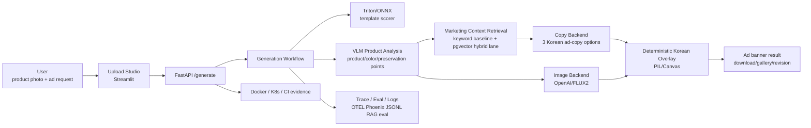

# Dessert Ad Studio Final Outcome Target

Updated: 2026-06-16

## Final Product Definition

Dessert Ad Studio v1 is a product-photo-preserving AI ad generation service for
small cafe and dessert businesses.

The user uploads one product photo and a short marketing request. The system
analyzes the product, retrieves industry/platform marketing guidance, generates
Korean ad copy, creates or composes a product-preserving visual, overlays Korean
text deterministically, and returns downloadable ad assets with evaluation,
trace, and deployment evidence.

## Canonical Portfolio Goal

This repository should be presented as:

> A product-photo-preserving AI ad generation service that demonstrates RAG,
> agent workflow orchestration, LLMOps/AgentOps evidence, and deployment-shaped
> AI backend engineering evidence.

The project should not be framed as "a dessert ad app" or "an image generation
demo." The dessert/cafe domain is the concrete business scenario. The hiring
signal is the ability to build, evaluate, observe, and deploy a multimodal AI
workflow as a reliable service.

## Korean Hiring Validation

Validated on 2026-06-15 against roughly 45 non-duplicate Korean AI Agent, RAG,
LLMOps, backend AI, and inference-serving job postings across Wanted, Remember,
Saramin/Jumpit, JobKorea, and company career pages. This sample is enough to
fix the portfolio direction, but not enough for exact market-share statistics.

| Repeated Korean hiring signal | Portfolio implication |
|---|---|
| RAG, retrieval, vector DB, hybrid search, reranking | Build keyword retrieval first, then add measured hybrid/vector retrieval. Do not claim RAG quality without eval evidence. |
| FastAPI, API contracts, backend service operation | Keep FastAPI as the core service boundary and add job/status, history, failure handling, and smoke evidence. |
| Docker, Kubernetes, CI/CD, health checks, monitoring | Treat deployability and operational evidence as first-class deliverables, not extras. |
| LangGraph/LangChain/LlamaIndex, tool/function calling, agent workflow | Show an explicit typed workflow for product analysis, retrieval, copy, image, overlay, and evaluation. |
| LLMOps/AgentOps, quality evaluation, trace, latency/cost/failure monitoring | Add reproducible evals, OTEL/Phoenix traces, JSONL summaries, and regression checks. |
| vLLM, Triton, ONNX, TensorRT, SGLang | Keep Triton/ONNX as concrete serving proof. Add vLLM/TensorRT only when a measured serving benchmark supports the story. |
| MCP/A2A | Treat as a later thin integration layer and hiring bonus, not the main product path. |

Confirmed positioning:

> For the Korean market, the strongest senior portfolio angle is not model
> novelty. It is measured retrieval + AI backend + workflow orchestration +
> evaluation + observability + deployability evidence.

## Current Verification Scope

Verified:

- Deterministic preservation/composition path for public samples.
- Korean text rendering through deterministic overlay instead of image-model
  text rendering.
- Curated retrieval baseline plus a measured pgvector storage/query lane.
- Redis/RQ and Postgres job/history path in Docker Compose.
- Local/demo AgentOps trace evidence and Kubernetes Kustomize render evidence.

Not yet proven:

- Provider-quality image editing. The first paid OpenAI image-edit gate failed;
  a stronger `gpt-image-2` + `quality=medium` gate is prepared but not run.
- Live Kubernetes operation. Current Kubernetes evidence now includes a
  fail-closed live smoke script, but no local/test cluster run has been captured.
- Production trace privacy. Current trace evidence is local/demo scoped and
  still needs an attribute allowlist test before production claims.
- Broad quality statistics. Current evals are useful regression gates but still
  demo-scale.

## Target Architecture

## Required Features

| Area | Final target |
|---|---|
| Input | Product photo upload plus product name, price/benefit, campaign purpose, tone, platform, and target audience. |
| Product analysis | Detect product name, dominant colors, mood, selling points, and visual preservation notes. |
| Retrieval | Retrieve cafe/dessert, platform, CTA, discount, premium-tone, and prohibited-claims guidance. Keep keyword retrieval as the default path and expose measured `pgvector_hybrid` as the vector lane. |
| Copy | Generate at least 3 structured Korean copy options with headline, body, and CTA. |
| Image | Generate or compose a product-preserving ad visual, with explicit reference-image support behavior per backend. |
| Korean overlay | Do not ask the image model to render Korean text. Render copy, price, CTA, and layout deterministically with PIL, Canvas, or HTML/CSS. |
| Result UX | Show one representative banner, copy/style candidates, download action, and result gallery. |
| Revision loop | Support concise revision requests such as more premium, emphasize discount, shorter copy, or warmer tone. First gate complete through the optional `revision_request` generation field and Streamlit input. |
| API/agent surface | FastAPI remains the core service boundary. A2A/FastMCP should be thin wrappers after the workflow stabilizes. |

## Target Quality And Performance

| Metric | Target |
|---|---|
| API health | Mock/demo backend path passes tests and smoke checks. |
| Latency | Mock path p95 <= 2 seconds; OpenAI path p95 <= 30 seconds; FLUX2/GPU path measured and documented separately. |
| Copy quality | Across 10-20 representative samples: Korean text presence 100%, product-name inclusion >= 90%, prohibited-claim violations 0. |
| Retrieval quality | Retrieval eval set category hit rate >= 80%; prohibited-claims guidance hit rate 100%. |
| Image quality | Product-preservation checklist pass rate >= 80%; Korean overlay rendering failures 0. Deterministic public-sample preservation first gate: pass rate 1.00, minimum top-region pixel match 1.00. Paid OpenAI image-edit first gate failed and is documented as model-quality evidence, not hidden. The next provider-quality gate now requires multi-sample ROI color/hash/edge preservation, latency, redaction, and text-contamination checks. |
| Error handling | Backend failures map to Korean `AdBackendError`; unknown backend, unsupported reference image, and missing API key fail clearly. |
| Regression guard | `pytest`, `ruff`, API smoke, retrieval eval, and workflow eval commands are documented and reproducible. |

## Non-Functional Completion Criteria

| Axis | Why it matters | Required artifact |
|---|---|---|
| Evaluation | Proves quality instead of relying on visual taste. | `docs/evidence/rag-baseline.md`, eval JSON/summary. |
| Observability | Shows where the workflow is slow or failing. | OTEL trace, Phoenix screenshot, JSONL logs. |
| Deployability | Shows the service can be operated beyond a notebook demo. | Docker Compose, K8s manifests, smoke evidence. |
| Reproducibility | Lets reviewers rerun the same demo. | Sample inputs, fixed outputs, documented commands. |
| Security/privacy | Avoids persisting raw photo, prompt, API response, or secrets. | Redacted trace policy and `.env` guard. |
| Maintainability | Keeps backend swaps and workflow changes controlled. | Backend contract, ADRs, tests, contract reviewer. |
| Cost/operations | Controls paid model calls and runtime failures. | Usage logging, smoke scripts, model config. |
| Portfolio evidence | Makes the hiring signal visible. | README, screenshots, architecture diagram, demo gallery. |

## Intermediate Milestones

| Stage | Goal | Completion evidence |
|---|---|---|
| M1 RAG baseline eval | Prove the current keyword retriever is useful before adding vector DB. | Complete: `docs/evidence/rag-baseline.md`, eval JSON, category hit rate 1.00, prohibited-claims hit rate 1.00. |
| M2 Hybrid retrieval | Compare Qdrant/pgvector/Chroma or a no-adoption baseline before choosing. | Complete: `docs/adr/0007-pgvector-marketing-context-retrieval.md`, `docs/evidence/pgvector-retrieval.md`, pgvector hybrid precision 1.00 vs keyword baseline precision 0.75 on the current 10-sample eval set. |
| M3 Service workflow hardening | Make generation observable and resumable enough for real UX. | Complete: Redis/RQ job queue, `/generation-jobs` status API, redacted Postgres history, Korean reference-image async rejection, API tests, Redis/RQ smoke, Postgres history smoke, full containerized API/worker smoke with Triton scorer, and Streamlit polling/history UX. |
| M4 Real product analysis | Replace mock product analysis with a real VLM-backed analyzer while preserving redaction policy. | Complete first analyzer gate: OpenAI Responses Vision adapter, ADR, no-network tests, env/compose wiring, one redacted live smoke, 10-case synthetic reference eval, pass rate 1.00, p95 latency 13.15s. |
| M5 Observability and eval package | Make quality, latency, cost, and failure behavior reviewable. | Complete first gate: Phoenix/OTEL trace screenshots, JSONL logs, `docs/evidence/workflow-eval-summary.json`, deterministic workflow score 1.00, failure_count 0, failure-case report fields. |
| M6 Portfolio packaging | Turn implementation into a senior-reviewable artifact. | Complete first gate: evidence index at `docs/evidence/README.md`, demo gallery at `docs/evidence/demo-gallery.md`, architecture image at `docs/evidence/assets/architecture.svg`, Streamlit reviewer screenshots at `docs/evidence/streamlit-reviewer-flow.md`, real-sample preservation evidence at `docs/evidence/real-sample-preservation.md`, paid OpenAI image-edit failure evidence at `docs/evidence/openai-image-edit-preservation.md`, README links, reproducible command map. |
| M7 Adversarial hardening | Apply independent senior-review criticism to remove overclaiming and close the strongest evidence gaps. | In progress: `docs/reference/adversarial-portfolio-review.md` captures findings, and `scripts/k8s_live_smoke.py` adds fail-closed live smoke automation. Next evidence should capture an actual local/test K8s run, provider-quality image-edit gate, larger eval pack, trace allowlist tests, and async reliability matrix. |

## Failure Conditions

The project is not portfolio-ready if any of these remain true:

1. It lists many technologies but cannot show measured evaluation, trace, or
   deployment evidence.
2. It claims RAG quality without retrieval metrics and representative examples.
3. It uses vector DB before proving keyword retrieval limitations.
4. It asks an image model to render Korean text instead of deterministic overlay.
5. It lacks job/status, failure recovery, or clear user-facing error behavior for
   slow image generation.
6. It stores raw prompts, raw model responses, customer photos, or secrets in
   persistent traces/logs.
7. MCP/A2A, vLLM, or TensorRT distract from the core product path without a
   benchmark or integration reason.
8. The README shows a demo but not the engineering controls behind it.

## Open Decisions

These decisions still need explicit selection before implementation:

| Decision | Default until decided | Decision standard |
|---|---|---|
| Vector retrieval backend | Decided: pgvector hybrid lane; keyword remains default | Reevaluate if pgvector precision stops beating keyword baseline as the guide corpus grows, or if dedicated vector DB operations become more important than Postgres integration. |
| Queue/history stack | Decided: Redis/RQ plus Postgres redacted history | Reevaluate only if durable queued payloads, complex routing, scheduled retries, or reference-image async storage are required. |
| Real VLM provider | Decided first provider: OpenAI Responses Vision; mock remains default | Reevaluate if latency, cost, parse failures, or image privacy constraints beat the current OpenAI trade-off. |
| Agent framework adoption | Explicit typed workflow in current code | Adopt LangGraph only if it reduces workflow complexity or improves traceability. |
| Serving optimization lane | Keep Triton/ONNX proof | Add vLLM/TensorRT/SGLang only with a targeted benchmark and role-specific portfolio reason. |
| MCP/A2A | Later thin wrapper | Add only after the core workflow/API is stable and documented. |

## Final Deliverables

1. `README.md`: project explanation, run commands, architecture image, and sample output.
2. `docs/evidence/`: RAG eval, workflow trace, K8s/Docker validation, evidence index, sample gallery.
3. `docs/adr/`: keyword retrieval, K8s, backend, and adoption decisions.
4. `docs/evidence/assets/demo-gallery/`: committed representative banner set, with raw regenerated files ignored under `outputs/demo-gallery/`.
5. `tests/`: backend contract, workflow, prompt, retrieval, API, and eval coverage.
6. `deploy/`: Docker Compose and Kubernetes manifests.
7. Runnable demo: local Streamlit/FastAPI or compose-based execution.

## Final Success Statement

The project is complete when it can be described accurately as:

> A small-business ad-generation workflow that takes a product photo, performs
> VLM product analysis, retrieves marketing guidance, generates Korean ad copy,
> creates a product-preserving visual, renders Korean text deterministically, and
> ships with evaluation, trace, deployment, and reproducibility evidence.

## Next Milestone

The immediate M6 portfolio-packaging gate is complete, but the adversarial
review moved the project into M7 hardening. The next milestone should run
`scripts/k8s_live_smoke.py` against a local/test Kubernetes context, or add a
disposable `kind` bootstrap path if this machine needs to create that context.
After a live K8s proof is captured, run the strengthened `gpt-image-2` +
`quality=medium` provider-quality image-edit gate only if a second paid
iteration is approved.
